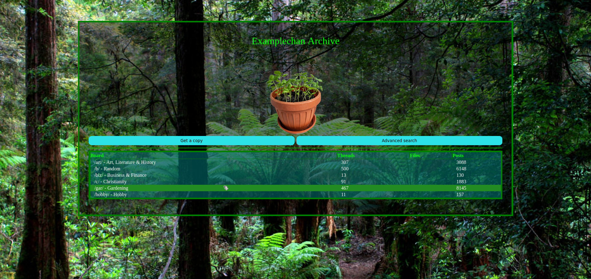
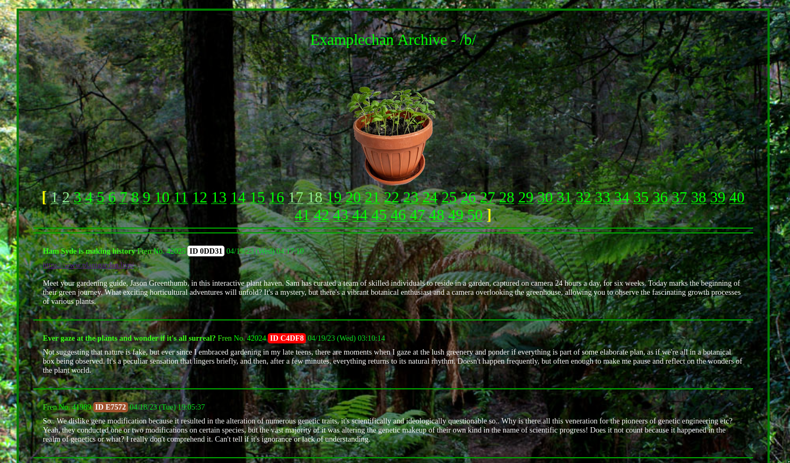

# Vichan Scrapper
> scrapper for archiving data from vichan instances with a minimalistic frontend included to ease local viewing

### Demo




### Disclaimer
The scrapper worked pretty well for the specific instance it was built around / tested on,
however it's possible that it will fail on different version (which is unknown)
and or configuration.

### Requirements
+ Python3
+ Sqlite3
+ Apache2 or PHP (see Installation/Server)

### Installation
1. Meet the requirements
#### Base
```sh
$ make init		# initialize databse and python environment
$ make clone	# create tarballs for distribution
```
##### Server
###### For yourself
+ If you don't have to have the front end to be publicly facing, its easiest to use the built in server of the PHP interpreter.
1. Navigate to the front end's directory
```sh
$ cd <vichan_scrapper>/front_end/
```
2. Deploy the PHP server
```sh
$ php -S localhost:8000
```
3. Access it through your browser on the address:
localhost:8000
###### In production
1. Run apache
2. Add configs
```sh
$ make server
```
##### Schedule scrapper
```sh
$ make service
```
+ the default is to scrapp every hour, and attempt to get missing files every 3.5 hours
+ for personilazation see scrapper/service/cron.m4

### Configuration
#### Scrapper
#### Front end
+ front\_end/config.php
	- posts\_per\_page : int
	- search\_enabled : boolean

#### Recommendations
+ use XFS
